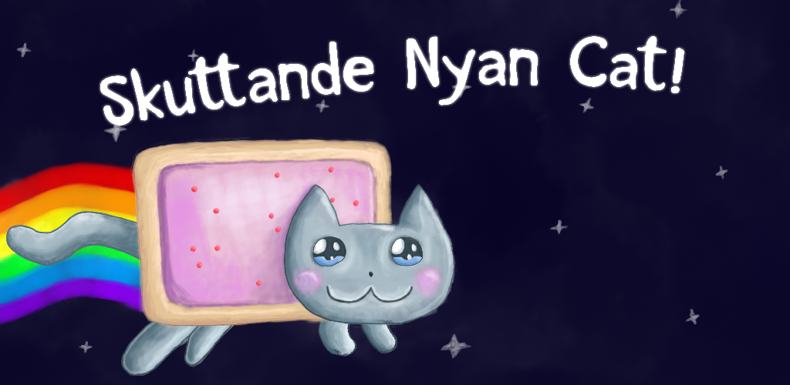
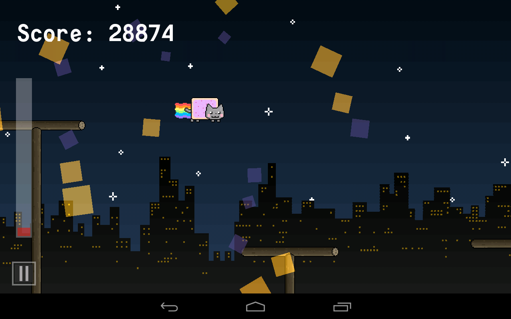
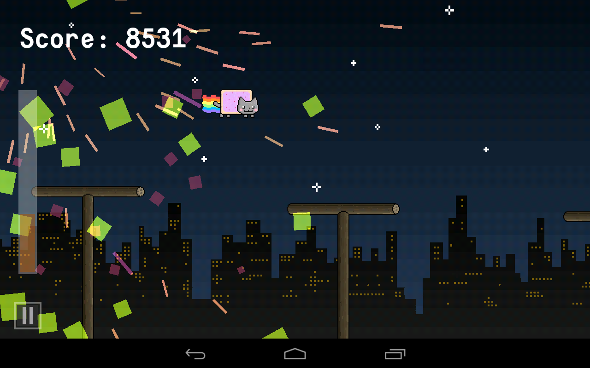
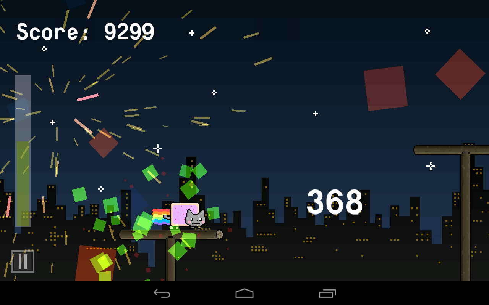

# Skuttande Nyan Cat!

  

Author: Daniel "MaTachi" Jonsson  
Tools: Eclipse, GIMP, Aseprite, MyPaint, as3sfxr, LibGDX's Particle Editor  
Development platform: Ubuntu 12.10  
Libraries: LibGDX, Artemis

  
  

## Install on your Android device from Google Play

Skuttande Nyan Cat! is [available on Google
Play](https://play.google.com/store/apps/details?id=se.danielj.skuttandenyancat)
for your Android device.

## File formats

* .xcf opens with GIMP.
* .sfs opens with [as3sfxr](http://www.superflashbros.net/as3sfxr/).
* [Particle effect](skuttande-nyan-cat-android/assets/effects) opens with
  LibGDX's [Particle
Editor](https://code.google.com/p/libgdx/wiki/ParticleEditor).

## Licenses

The code I have written is licensed under [GNU GPLv3](LICENSE.txt). The
images I have made, which are all in `images/`, `sprites/` and `sprites-dev/`
except the One Game A Month logo, are licensed under Creative Commons
Attribution-ShareAlike 3.0 Unported ([CC BY-SA
3.0](http://creativecommons.org/licenses/by-sa/3.0/)). The particle effects and
sound effects are also made by me and are licensed under CC BY-SA 3.0.

LibGDX is available under Apache License 2.0
[[link](https://code.google.com/p/libgdx/)].  
Artemis is available under New
BSD License. [[link](http://gamadu.com/artemis/)].

The font being used is Consola Mono which licensed under [SIL Open Font
License](http://scripts.sil.org/cms/scripts/page.php?site_id=nrsi&id=OFL) and
can be downloaded from [this page](http://openfontlibrary.org/font/consolamono).

The background music is Nyanyanyanyanyanyanya! by daniwellP.

## Texture packer

    rm skuttande-nyan-cat-android/assets/sprites/sprites.{atlas,png} ; java -classpath skuttande-nyan-cat/libs/gdx.jar:skuttande-nyan-cat/libs/gdx-tools.jar com.badlogic.gdx.tools.imagepacker.TexturePacker2 sprites skuttande-nyan-cat-android/assets/sprites sprites
